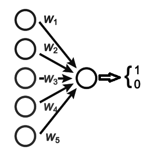
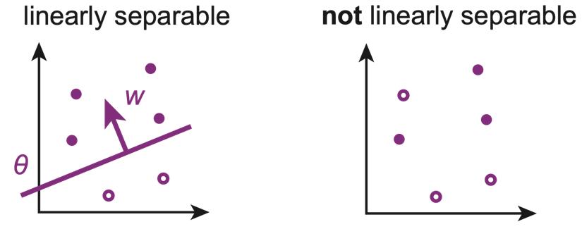

# perceptron
Python code for perceptron, linear separability and Cover's function counting theorem

The perceptron is an algorithm for supervised learning of binary classifiers.

Two subsets are said to be linearly separable if there exists a hyperplane that separates the elements of each set in a way that all elements of one set resides on the opposite side of the hyperplane from the other set.

Cover's function counting theorem gives the number of linearly separable pattern sets out of *p* sets given inputs in general position in the *n*-th dimensional space [(Cover, 1965)](https://ieeexplore.ieee.org/document/4038449).

# License
This project is licensed under the MIT License.
